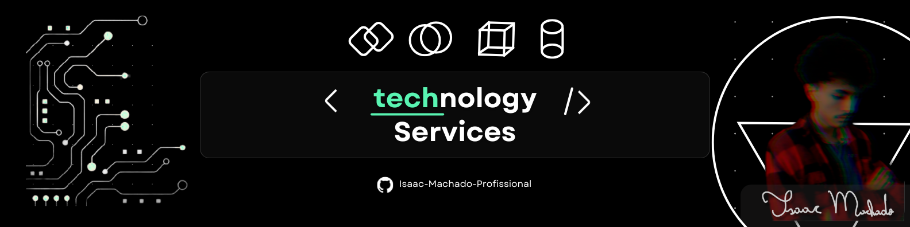

<h1>About me: </h1>

I'm a academic on **UNIVESP**, one public university from the state of São Paulo in Brazil, cursing **Computer Engineering**.  
Now i'm pretty ready to show us my tech-skills, digital/analogic solution, innovations and geral maintence in hardware and software systems.

  <h1>Stacks:</h1>
  

  
<h1>Contact:</h1>
  

  

  

