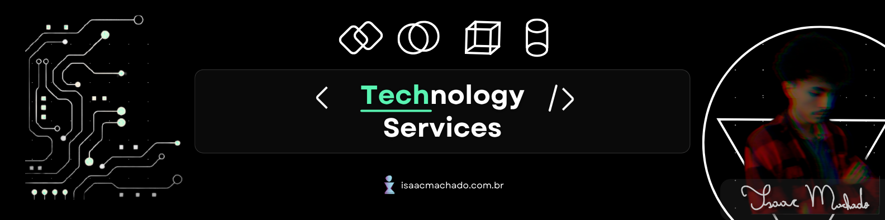

<!--  -->  

<h1>👤 About me: </h1>

I'm a academic on **UNIVESP**, one public university from the state of São Paulo in Brazil, cursing **Computer Engineering**.  
Now i'm pretty ready to show us my tech-skills, digital/analogic solution, innovations and geral maintence in hardware and software systems.

  <tr>
    <td>
      
    </td>
    <td>
      
    </td>
  </tr>

 
  

<h1>Programming Languages</h1>
  
  
  
 
 

<h3>Web Development:</h3>
  
  
  
  
  
 
 

<h3>Frameworks:</h3>
 
 
 
 
 

 
<h3>Database:</h3>
 
 
 
 

<h3>Hosting:</h3>
 
 
 

 
<h3>Design & Prototyping:</h3>
 
 
 
 
 
 

  
<h1>Contact</h1>
  

  

  

